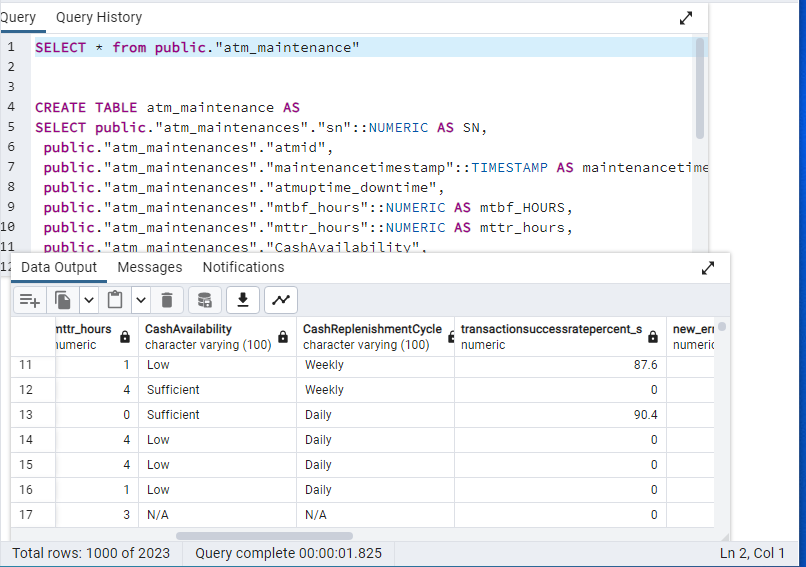
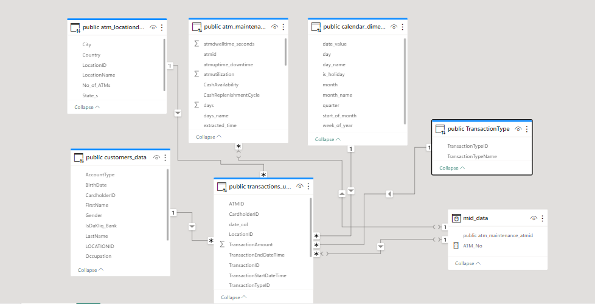
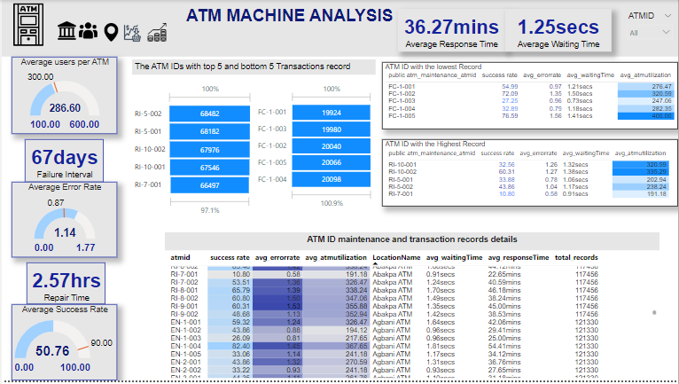
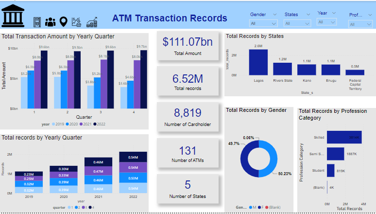
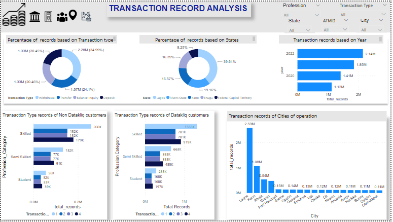
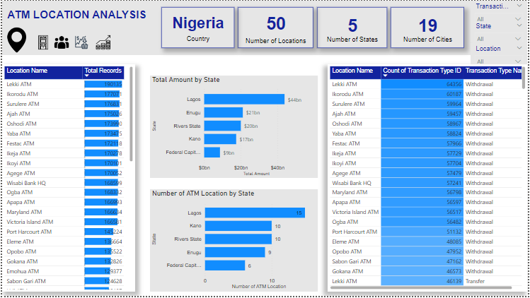

# Datakliq-capstone
Datakliq Cohort 3 project 

---
## Introduction 
The ATM, an Automated Teller Machine, stands as a cornerstone of modern banking, serving as a vital link between customers and their finances.
These self-service kiosks allow 24/7 access to basic banking functions like withdrawals, deposits, and transfers, empowering customers with flexibility and immediacy.
This accessibility and ease of use not only satisfy customers’ demands for convenience but also solidify their loyalty, playing a pivotal role in retaining a satisfied clientele within the dynamic landscape of financial services.
Recognizing the significance of retaining customers, this project aims to explore data-centric approaches to optimize ATM performance, ultimately bolstering our strategies for enhancing customer retention.

## Objective
The project objectives are as follows:
- Uncover insights for a deeper understanding of customer behavior.
- Analyze ATM operational efficiency metrics, including ATM utilization, success rate, error rate, wait time, and service response time.
- Investigate transaction records to comprehend customer transaction behaviors.
- Examine ATM location transaction data to inform strategies for cultivating enduring customer relationships.
---

## Tools used
In this project, SQL (PostgreSQL) will be utilized for dataset cleaning purposes. Additionally, Microsoft Power BI will serve as the primary tool for data analysis and visualization.

---

## Dataset Description
This dataset is Datakliq Cohort 3 project dataset, obtained from the datakliq_education_hub.
It contains seven dimension tables (hour table, Calendar table, ATM Location table, Customers table, ATM Maintenance table) all of which are in CSV format, and a Fact table that is a union of Five different States (Lagos State, Enugu State, Federal Capital Territory, Kano State, Rivers State) Transaction records.

---

## Data Transformation
During the analysis phase, SQL (PostgreSQL) was employed for the process phase. Microsoft Power BI, on the other hand, was used for the Analyze and visualization phases.

For the process phase, the initial step involved importing the CSV file into PostgreSQL. Subsequently, columns were modified to fit appropriate data types. Null values within columns of Numeric data types were replaced with "0". Additionally, a Calendar dimension table was created, and the transaction records from the five states were merged to form a unified Transaction table.
The removal of duplicates was executed using the "Select Duplicates" functionality.

---

## Data Modelling
The clean tables from the postgresql were uploaded to Microsoft Power Bi through the import mode. The tables were linked together through Snowflake Modelling. The relationship established between the tables is the "one-to-many" relationship. When it is taking a long period of time to analyze and visualize data, I switch to direct query mode. 

---

## Analysis and Visualization

The analysis of ATM machine maintenance indicates that out of determinants factors such as Success rate, Error rate, service response rate, average waiting time, success rate has significant effect on average user per ATM. The higher the success rate of the machine the higher the number of Cardholders that use the ATM. However, this does not seem to have an effect on Transaction Records of the ATMs.

The analysis of ATM Transaction Records spanning from January 2019 to December 2022 reveals a record of over 6.52 million ATM transactions took place over the four years period. Furthermore, the total transaction amount amassed over the four-year span is an impressive 111.07 billion Naira.

The analysis of transaction records of each state highlights Lagos as the leading region with transaction records at 39.64%. Followed by  Rivers, representing 19.16% of the total transactions. Kano and Enugu closely followed, accounting for 16.57% and 16.39% of transactions, respectively. Abuja, while comparatively lower, still contributed notably with 8.25% of the total transactions.

The analysis of transaction type reveals that the transaction type with the highest records is  withdrawals which constitute 34.99% of the total transactions within the dataset. Followed by transfers which accounted for 24.1% of the transactions, while balance inquiries and deposits stood closely at 20.46% and 20.45%, respectively.

The analysis of the customers dataset unveiled  a notable trend where the skilled population emerged as the predominant leaders in transactional activity among both Datakliq bank customers and non-Datakliq bank customers alike.

The analysis of Location name records reveals that the city with the highest records is Lagos, the Location with the highest records is Lekki ATM, followed by Ikorodu Atm, while the location with. The lowest record is wuse atm.

---

## Conclusion
ATM machine is not just a regular machine tools to aid process but also can be viewed as a branch of a bank on its own. Therefore, there is need for more data driven analysis to aid ATM Optimization for Customers retention.

---

## Recommendations

In this era of advancing Technology, Artificial intelligence (AI) should be incorporated to monitor the success rate and guide the Cardholders through their transactions, which will inadvertently reduce the average wait time, error rate.

While it shows that the skilled population have the highest records, adding a voice prompt in collaboration with AI, to help guide the unskilled who might be unlearned in the use of Tech to guide them through their transactions by asking for their fingerprints, will reduce error rate, increase success rate, decrease average wait time and reduce fraudulent activities.

Factors affecting transaction records disparities in states of operations must be further analyzed.

---

## Additional Resources 
project datasets here
SQL Queries and Data Analysis Expression Functions here
